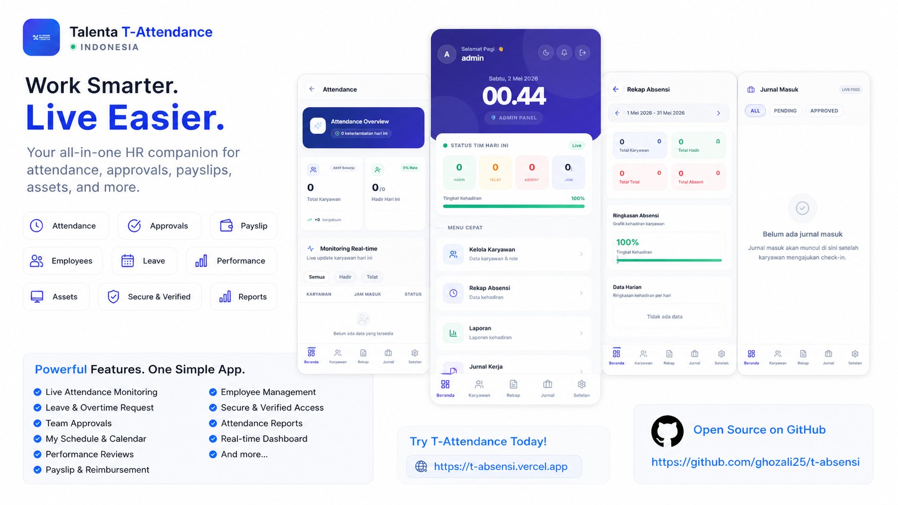

<div align="center">
  
</div>

# T-Attendance



Sistem manajemen absensi berbasis web yang dibangun dengan React, TypeScript, dan MySQL.

## Tech Stack

- **Frontend**: React 18, TypeScript, Vite
- **UI Components**: shadcn/ui, Radix UI
- **Styling**: Tailwind CSS
- **Backend**: MySQL 8.0+ (Database), Express.js (API)
- **Authentication**: JWT (JSON Web Tokens)
- **State Management**: React Hook Form, TanStack Query
- **Charts**: Recharts
- **Excel Export**: ExcelJS, XLSX
- **PDF Export**: jsPDF, jsPDF-AutoTable

## Prerequisites

- Node.js (v18 atau lebih tinggi)
- npm atau yarn
- MySQL 8.0+ (untuk database)
- MySQL Client (MySQL Workbench, DBeaver, atau command line)

## Setup

### 1. Clone Repository

```bash
git clone <YOUR_GIT_URL>
cd t-absensi
```

### 2. Install Dependencies

```bash
npm install
```

### 3. Setup Environment Variables

Buat file `.env` di root project dengan meng-copy dari `.env Example`:

```bash
cp ".env Example" .env
```

Edit file `.env` dan isi dengan konfigurasi MySQL Anda:

```env
# Database Configuration
DB_HOST=localhost
DB_PORT=3306
DB_USER=root
DB_PASSWORD=your_mysql_password
DB_NAME=t_absensi

# JWT Secret (generate random string)
JWT_SECRET=your_random_jwt_secret_key_here
```

### 4. Setup MySQL Database

#### Quick Method (Recommended)

Jalankan perintah ini untuk migrasi fresh dengan seeding (seperti Laravel `migrate:fresh --seed`):

```bash
npm run migrate:fresh
```

Perintah ini akan:
- 🗑️ Drop database jika ada
- 📦 Buat database baru
- 📜 Jalankan semua migrasi
- 🌱 Seed data default (admin user)

#### Option A: Via MySQL Command Line

```bash
mysql -u root -p < scripts/mysql_migration.sql
```

#### Option B: Via MySQL Workbench / DBeaver

1. Buka MySQL Workbench atau DBeaver
2. Connect ke MySQL server Anda
3. Buka file `scripts/mysql_migration.sql`
4. Jalankan seluruh script SQL

#### Option C: Manual Step-by-Step

Jika Anda ingin menjalankan migrasi secara manual:

```sql
-- 1. Buat database
CREATE DATABASE IF NOT EXISTS t_absensi CHARACTER SET utf8mb4 COLLATE utf8mb4_unicode_ci;
USE t_absensi;

-- 2. Jalankan script migrasi lengkap dari scripts/mysql_migration.sql
-- Script ini akan membuat semua tabel, indexes, triggers, dan view yang dibutuhkan
```

Script migrasi akan membuat:
- **users** - Tabel pengguna dengan autentikasi
- **user_roles** - Tabel role (admin, manager, employee)
- **profiles** - Tabel profil karyawan
- **departments** - Tabel departemen
- **attendance** - Tabel data absensi
- **attendance_periods** - Tabel periode absensi
- **work_journals** - Tabel jurnal kerja
- **audit_logs** - Tabel log audit
- **v_attendance_summary** - View untuk ringkasan absensi

### 5. Default Users

Script migrasi akan otomatis membuat user default:

**Admin Credentials:**
- **Email**: admin@talenta.com
- **Password**: password

**Demo Employee Accounts:**
- **karyawan1@talenta.com** - Budi Santoso (Engineering - Software Engineer)
- **karyawan2@talenta.com** - Siti Aminah (Marketing - Marketing Specialist)
- **karyawan3@talenta.com** - Ahmad Wijaya (Finance - Accountant)
- **karyawan4@talenta.com** - Dewi Kartika (HR - HR Specialist)
- **karyawan5@talenta.com** - Rudi Hartono (Operations - Operations Manager)

**Password untuk semua demo accounts**: `password`

⚠️ **Penting**: Ganti password admin default setelah login pertama untuk keamanan.

### 6. Jalankan Development Server

```bash
npm run dev
```

Aplikasi akan berjalan di `http://localhost:8080`

### Jalan backend dan frontend

```bash
npm run dev:full
```

## Build untuk Production

```bash
npm run build
```

File build akan ada di folder `dist/`.

## Preview Production Build

```bash
npm run preview
```

## Linting

```bash
npm run lint
```

## Struktur Project

```
t-absensi/
├── src/
│   ├── components/       # Komponen UI reusable
│   ├── pages/           # Halaman aplikasi
│   ├── lib/             # Utility functions dan helpers
│   ├── hooks/           # Custom React hooks
│   ├── integrations/    # Database integrations (MySQL)
│   └── types/           # TypeScript type definitions
├── scripts/             # SQL migration scripts
│   └── mysql_migration.sql  # Database migration script
├── public/              # Static assets
└── docs/                # Dokumentasi tambahan
```

## Fitur Utama

- Manajemen absensi karyawan
- Dashboard dengan statistik dan grafik
- Export data ke Excel dan PDF
- Manajemen periode absensi
- Work journal / log aktivitas
- Role-based access control
- Dark mode support
- Responsive design (mobile-friendly)
- Manajemen departemen
- Reset password karyawan
- Real-time monitoring absensi

## Update Terbaru

### Database Schema Updates
- Tambah kolom `status` pada tabel `attendance` untuk tracking status kehadiran
- Tambah kolom `deleted_at` pada tabel `attendance` untuk soft delete
- Tambah tabel `departments` untuk manajemen departemen

### API Endpoints
- `POST /api/auth/me` - Verifikasi token dan dapatkan user saat ini
- `POST /api/auth/check-db` - Diagnostik koneksi database dan role
- `POST /api/db/query` - Eksekusi query SQL SELECT (untuk query kompleks)
- `POST /api/db/execute` - Eksekusi DML operations (INSERT, UPDATE, DELETE)
- `GET /api/attendance` - Query absensi dengan filter tanggal dan user
- `GET /api/attendance?start_date=&end_date=` - Query range tanggal absensi

### MySQL Client Proxy
- Implementasi shim MySQL client yang proxy ke backend API
- Mendukung query SQL kompleks melalui endpoint `/api/db/query`
- Kompatibilitas untuk kode legacy yang menggunakan `db.query`

### Frontend Updates
- Perbaikan tampilan dashboard di light mode
- Perbaikan React key warnings di komponen
- Implementasi fitur tambah departemen
- Implementasi reset password admin

## Dokumentasi Tambahan

Lihat folder `docs/` untuk dokumentasi lebih detail:
- `WORK_JOURNAL_ARCHITECTURE.md` - Arsitektur work journal
- `WORK_JOURNAL_UX_DESIGN.md` - Desain UX work journal
- `SETTINGS_AUDIT_FIXES.md` - Perbaikan audit settings
- `JOURNAL_UI_REDESIGN_SUMMARY.md` - Ringkasan redesign UI journal
